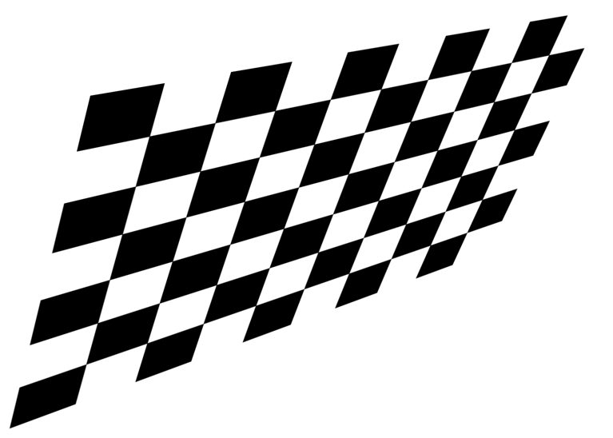
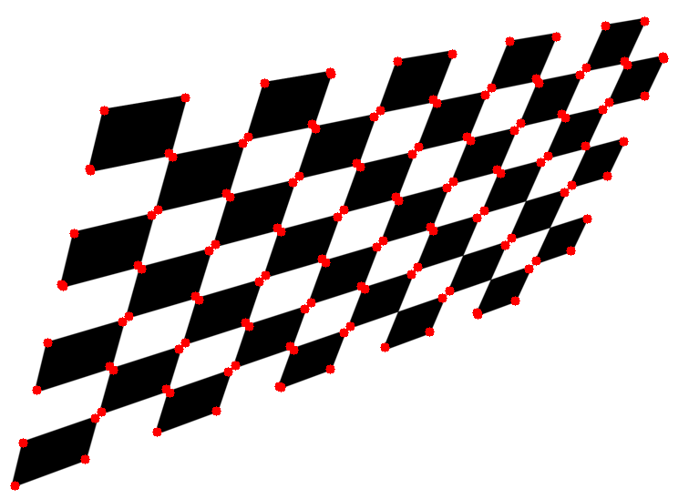

# OpenCV-Corner-Feature-Examples

## Examples

### 01-Corner Detection

Kitchen and Rosenfeld (1982) proposed a cornerness measure based on the change of gradient direction along an edge contour multiplied by the local gradient magnitude
[[1]](https://www.sciencedirect.com/science/article/abs/pii/0167865582900204). The red spots in the image shows the corner of the chessboard which are the regions in the image with large variation in intensity in all the directions. 

## Reference

[1]<https://www.sciencedirect.com/science/article/abs/pii/0167865582900204>
